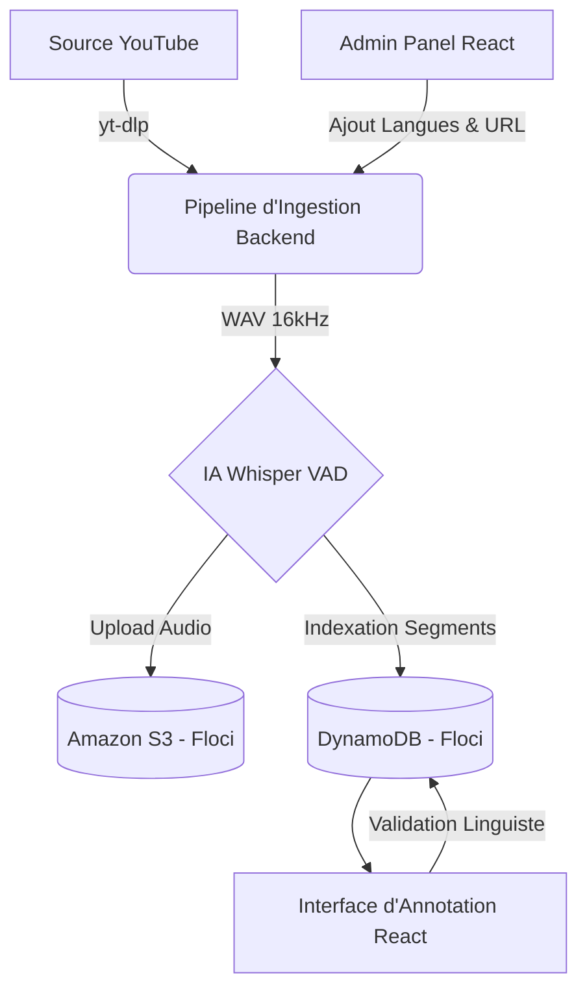

<div align="center">
  <h1>BantuVoice 🌍🎙️</h1>
  <p><strong>Initiative nationale de données linguistiques pour l'IA — CSGR-IA</strong></p>
  <p><em>L'Intelligence Artificielle · pour l'Afrique · par l'Afrique</em></p>

  <p>
    
    
    
    
    
    
  </p>
</div>

---

## 📑 Table des Matières
- [À propos du projet](#-à-propos-du-projet)
- [Fonctionnalités Principales](#-fonctionnalités-principales)
- [Architecture & Flux de Travail](#-architecture--flux-de-travail)
- [Prérequis & Installation](#-prérequis--installation)
- [Utilisation](#-utilisation)
- [Documentation API](#-documentation-api)
- [Éthique et Souveraineté](#-éthique-et-souveraineté)
- [Contribuer](#-contribuer)

---

## 📌 À propos du projet
88% des langues africaines sont absentes de l'IA mondiale. Les langues gabonaises (Fang, Punu, Obamba, Myènè, etc.) n'existent dans aucun modèle comme Whisper ou GPT, faute de données structurées.

**BantuVoice** est la première infrastructure souveraine de données linguistiques d'Afrique centrale. L'objectif est de collecter l'audio existant (traditions orales, chaînes YouTube comme *Dumwénu TV*), de le transcrire par IA, et de le valider via des locuteurs natifs pour créer un corpus de très haute qualité au standard Hugging Face.

---

## ✨ Fonctionnalités Principales

- 📥 **Pipeline d'Ingestion Automatisé** : Téléchargement direct depuis YouTube, conversion audio optimisée (16kHz, mono).
- 🤖 **Segmentation IA (Whisper)** : Découpage intelligent par détection d'activité vocale (VAD) pour isoler les phrases sans altérer le sens.
- ☁️ **Architecture Cloud-Native (Floci.io / AWS)** : Stockage des audios bruts sur **Amazon S3** et gestion ultra-rapide des données sur **Amazon DynamoDB**.
- 👥 **Double Annotation Scientifique** : Interface React.js premium pour la validation experte en aveugle par les linguistes.
- 🌓 **Interface Premium Dynamique** : Dashboard d'administration complet avec gestion des langues à la volée et bascule mode Clair / mode Sombre.

---

## 🏗️ Architecture & Flux de Travail

Le système complet s'appuie sur une infrastructure robuste, développée pour garantir la scalabilité et la souveraineté des données via **Floci.io** (simulation AWS locale).



### Les 4 Étapes du Projet
1. **Étape 01 : Collecte** (En production)
2. **Étape 02 : Segmentation IA** (En production)
3. **Étape 03 : Validation Scientifique** (MVP Terminé)
4. **Étape 04 : Export Hugging Face** (À venir - Format Apache Parquet)

---

## 🚀 Prérequis & Installation

### 1. Prérequis Système
- **Python 3.10+** et **Node.js 18+**
- **FFmpeg** installé et accessible dans votre `PATH`.
- Infrastructure Cloud locale : **Floci.io** ou **LocalStack** (exécutant S3 & DynamoDB sur `http://localhost:4566`).

### 2. Déploiement Local
1. **Cloner le dépôt :**
   ```bash
   git clone https://github.com/Gnzikoune/BantuVoice-MVP.git
   cd BantuVoice-MVP
   ```

2. **Backend & Base de données :**
   ```bash
   python -m venv venv
   # Activer: venv\Scripts\activate (Windows) ou source venv/bin/activate (Linux/Mac)
   pip install -r requirements.txt
   
   # Initialiser l'infrastructure AWS (Floci)
   python src/api/init_aws.py
   
   # Lancer le serveur
   python src/api/server.py
   ```

3. **Frontend :**
   ```bash
   cd src/frontend
   npm install
   npm run dev
   ```

---

## 📖 Utilisation

### Mode Administrateur
Connectez-vous via l'interface web (http://localhost:5173) avec le compte `gildas_admin` (mot de passe par défaut: `password123`).
Depuis l'onglet **Nouvelle Ingestion**, vous pouvez :
- Ajouter dynamiquement de nouvelles langues à suivre.
- Lancer le pipeline de téléchargement et segmentation en entrant une URL YouTube.

### Mode Linguiste (Annotation)
Connectez-vous avec `linguiste_a` ou `linguiste_b`. 
1. Sélectionnez une langue d'étude.
2. Choisissez un fichier audio.
3. Écoutez chaque segment généré et transcrivez dans la langue cible en validant avec `Ctrl + Entrée`.

---

## 🔌 Documentation API

Le backend s'appuie sur **FastAPI**. Voici les principales routes :

| Méthode | Endpoint | Description | Rôle Requis |
|---------|----------|-------------|-------------|
| `POST` | `/login` | Authentification JWT et récupération du token | Tous |
| `GET` | `/me` | Informations sur l'utilisateur courant | Tous |
| `GET` | `/languages` | Liste des langues gabonaises enregistrées (DynamoDB) | Tous |
| `GET` | `/audios` | Liste les fichiers audio, filtrables par `?language=` | Tous |
| `GET` | `/segments` | Récupère les segments à annoter pour un `audio_id` donné | Tous |
| `POST` | `/annotate` | Soumet ou met à jour la transcription d'un segment | Tous |
| `POST` | `/admin/collect` | Lance le pipeline complet (DL + Whisper + AWS) en tâche de fond | Admin |
| `GET` | `/admin/status` | Vérifie l'état d'avancement de la pipeline d'ingestion | Admin |
| `POST` | `/admin/languages`| Crée une nouvelle langue dynamiquement dans la base | Admin |
| `DELETE`| `/admin/languages/{code}`| Supprime une langue du registre | Admin |
| `DELETE`| `/admin/audios/{audio_id}`| Supprime un audio, ses segments DB, et le fichier S3 | Admin |

> Vous pouvez consulter la documentation Swagger complète en accédant à `http://127.0.0.1:8000/docs`.

---

## ⚖️ Éthique et Souveraineté

- **Souveraineté :** Les corpus finaux restent sous le contrôle strict du CSGR-IA. L'architecture AWS (Floci) permet de garder l'hébergement on-premise ou sur des serveurs souverains.
- **Transparence :** Consultez le fichier [`RESEARCH_LOG.md`](./RESEARCH_LOG.md) qui trace toutes nos décisions scientifiques, nos échecs méthodologiques (ex: Hallucinations de Whisper) et nos résolutions.

---

## 🤝 Contribuer

Si vous rejoignez l'équipe technique, votre première étape obligatoire est de lire le **[Guide de Contribution (CONTRIBUTING.md)](./CONTRIBUTING.md)**. Il détaille le Workflow Git (Branches, Pull Requests) et les obligations de rigueur scientifique.

---

<div align="center">
  <br>
  <em>Porteurs de projet : Gildas & Aryad (Pôle Technique & Innovation, CSGR-IA).</em>
</div>
