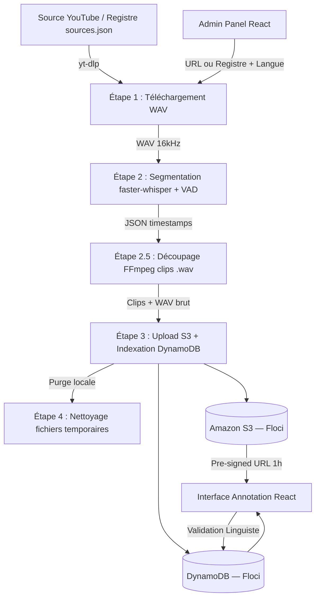

<div align="center">
  <h1>BantuVoice 🌍🎙️</h1>
  <p><strong>Initiative nationale de données linguistiques pour l'IA — CSGR-IA</strong></p>
  <p><em>L'Intelligence Artificielle · pour l'Afrique · par l'Afrique</em></p>

  <p>
    
    
    
    
    
    
    
  </p>
</div>

---

## 📑 Table des Matières
- [À propos du projet](#-à-propos-du-projet)
- [Fonctionnalités Principales](#-fonctionnalités-principales)
- [Architecture & Flux de Travail](#-architecture--flux-de-travail)
- [Prérequis & Installation](#-prérequis--installation)
- [Utilisation](#-utilisation)
- [Documentation API](#-documentation-api)
- [Éthique et Souveraineté](#-éthique-et-souveraineté)
- [Contribuer](#-contribuer)

---

## 📌 À propos du projet

88% des langues africaines sont absentes de l'IA mondiale. Les langues gabonaises (Fang, Punu, Obamba, Myènè, etc.) n'existent dans aucun modèle comme Whisper ou GPT, faute de données structurées.

**BantuVoice** est la première infrastructure souveraine de données linguistiques d'Afrique centrale. L'objectif est de collecter l'audio existant (traditions orales, chaînes YouTube comme *Dumwénu TV*), de le transcrire par IA, et de le valider via des locuteurs natifs pour créer un corpus de très haute qualité au standard Hugging Face.

---

## ✨ Fonctionnalités Principales

- 📥 **Pipeline d'Ingestion Automatisé** : Téléchargement depuis YouTube (URL unique ou registre de chaînes `sources.json`), conversion audio optimisée (16kHz, mono).
- 🤖 **Segmentation IA (faster-whisper)** : Découpage intelligent via détection d'activité vocale (VAD) avec timestamps au niveau du mot. 4× plus rapide que Whisper vanilla, sans PyTorch requis.
- ✂️ **Découpage Audio Précis (FFmpeg)** : Chaque segment est extrait en clip `.wav` individuel via copie de flux (sans réencodage — quasi-instantané).
- ☁️ **Architecture Cloud-Native sans état local** : Les fichiers audio sont uploadés sur **Amazon S3** (Floci), puis supprimés localement. Seul le JSON de métadonnées reste en local comme journal d'audit.
- 🔗 **Accès sécurisé pour les annotateurs (Pre-signed URLs)** : Les linguistes accèdent aux clips directement depuis leur navigateur via des URLs S3 temporaires (expire en 1h), sans jamais exposer les credentials AWS.
- 👥 **Double Annotation Scientifique** : Interface React.js premium pour la validation experte en aveugle par les linguistes.
- 🌓 **Interface Premium Dynamique** : Dashboard d'administration avec gestion des langues à la volée, terminal de logs temps réel, bascule mode Clair / Sombre.

---

## 🏗️ Architecture & Flux de Travail

Le pipeline complet s'appuie sur une infrastructure robuste garantissant la scalabilité et la souveraineté des données via **Floci.io** (AWS local).



### Les 5 Étapes du Pipeline IA

| # | Étape | Outil | Sortie |
|---|-------|-------|--------|
| 1 | **Collecte** | `yt-dlp` | `data/raw/{id}.wav` + `{id}.json` |
| 2 | **Segmentation IA** | `faster-whisper small` (CPU int8) | JSON enrichi de timestamps mot/segment |
| 2.5 | **Découpage audio** | `FFmpeg -c copy` | `data/segments/{id}/seg_XXXX.wav` |
| 3 | **Stockage cloud** | `boto3` → S3 + DynamoDB | Clips sur S3, métadonnées en DB |
| 4 | **Purge locale** | `shutil` + `os` | Disque libéré, données sur S3 |

### Les 4 Phases du Projet

1. **Phase 01 : Collecte & Ingestion** — En production
2. **Phase 02 : Annotation Scientifique** — MVP Terminé
3. **Phase 03 : Export & Publication** — À venir (format Apache Parquet → Hugging Face)
4. **Phase 04 : Modèles Fine-tunés** — À venir (fine-tuning sur corpus validé)

---

## 🚀 Prérequis & Installation

### 1. Prérequis Système

- **Python 3.10+** et **Node.js 18+**
- **FFmpeg** installé et accessible dans votre `PATH` (ou défini via `FFMPEG_PATH` dans `.env`)
- Infrastructure Cloud locale : **Floci.io** ou **LocalStack** (S3 & DynamoDB sur `http://localhost:4566`)

> ℹ️ **PyTorch n'est plus requis.** Le moteur IA `faster-whisper` utilise CTranslate2 (C++), nettement plus léger.

### 2. Déploiement Local

1. **Cloner le dépôt :**
   ```bash
   git clone https://github.com/Gnzikoune/BantuVoice-MVP.git
   cd BantuVoice-MVP
   ```

2. **Backend & Infrastructure AWS :**
   ```bash
   python -m venv venv
   # Windows :
   venv\Scripts\activate
   # Linux/Mac :
   # source venv/bin/activate

   pip install -r requirements.txt

   # Copier et configurer les variables d'environnement
   cp .env.example .env
   # Éditer .env : définir FFMPEG_PATH si ffmpeg n'est pas dans le PATH

   # Initialiser les tables DynamoDB (Floci/LocalStack)
   python src/api/init_aws.py

   # Lancer le serveur FastAPI
   python src/api/server.py
   ```

3. **Frontend React :**
   ```bash
   cd src/frontend
   npm install
   npm run dev
   # Interface disponible sur http://localhost:5173
   ```

### 3. Variables d'environnement (`.env`)

| Variable | Description | Défaut |
|----------|-------------|--------|
| `FFMPEG_PATH` | Chemin vers le dossier `bin/` de FFmpeg | Chemin WinGet automatique |
| `AWS_ENDPOINT_URL` | URL de l'infrastructure Floci/LocalStack | `http://localhost:4566` |
| `S3_BUCKET` | Nom du bucket S3 | `bantuvoice-audios` |
| `SECRET_KEY` | Clé secrète JWT | **Obligatoire en production** |

---

## 📖 Utilisation

### Mode Administrateur

Connectez-vous via `http://localhost:5173` avec `gildas_admin` / `password123`.

Depuis l'onglet **Nouvelle Ingestion** :
- **Mode Vidéo unique** : entrez une URL YouTube directe ou une playlist.
- **Mode Registre** : lancez la collecte de toutes les sources `active` définies dans `config/sources.json`.

Le terminal de logs temps réel affiche chaque étape du pipeline (téléchargement → segmentation → découpage → upload S3 → purge locale).

### Mode Linguiste (Annotation)

Connectez-vous avec `linguiste_a` ou `linguiste_b` / `password123`.

1. Sélectionnez une langue d'étude.
2. Choisissez un fichier audio dans la bibliothèque.
3. Pour chaque segment : l'audio est chargé depuis S3 via une URL sécurisée temporaire, transcrivez dans la langue cible et validez avec `Ctrl + Entrée`.

---

## 🔌 Documentation API

Backend **FastAPI** — documentation Swagger interactive : `http://127.0.0.1:8000/docs`

### Authentification

| Méthode | Endpoint | Description | Rôle |
|---------|----------|-------------|------|
| `POST` | `/login` | Authentification JWT | Tous |
| `GET` | `/me` | Informations utilisateur courant | Tous |

### Référentiel

| Méthode | Endpoint | Description | Rôle |
|---------|----------|-------------|------|
| `GET` | `/languages` | Liste des langues (DynamoDB) | Tous |
| `GET` | `/audios` | Bibliothèque d'audios (`?language=` optionnel) | Tous |

### Annotation

| Méthode | Endpoint | Description | Rôle |
|---------|----------|-------------|------|
| `GET` | `/segments/{audio_id}` | Segments d'un audio avec texte Whisper | Tous |
| `GET` | `/segments/{audio_id}/{segment_id}/audio` | **Pre-signed URL S3** pour écouter le clip (expire 1h) | Tous |
| `POST` | `/annotate` | Soumet ou met à jour la transcription d'un segment | Tous |

### Administration

| Méthode | Endpoint | Description | Rôle |
|---------|----------|-------------|------|
| `POST` | `/admin/collect` | Lance le pipeline complet (URL ou registre) | Admin |
| `GET` | `/admin/status` | Statut et logs temps réel du pipeline | Admin |
| `GET` | `/admin/audios` | Liste complète des audios ingérés | Admin |
| `DELETE` | `/admin/audios/{audio_id}` | Supprime un audio (DB + S3) | Admin |
| `GET` | `/admin/sources` | Liste les sources du registre `sources.json` | Admin |
| `GET` | `/admin/languages` | Liste des langues configurées | Admin |
| `POST` | `/admin/languages` | Crée une nouvelle langue | Admin |
| `DELETE` | `/admin/languages/{code}` | Supprime une langue | Admin |

---

## ⚙️ Architecture des Modules

```
BantuVoice-MVP/
├── src/
│   ├── api/
│   │   ├── server.py          # API FastAPI — routes, pipeline, auth JWT
│   │   └── init_aws.py        # Initialisation DynamoDB (tables) + S3 (bucket)
│   ├── collecte/
│   │   └── downloader.py      # Téléchargement YouTube (yt-dlp) — mode URL ou registre
│   └── transcription/
│       ├── transcriber.py     # Segmentation IA (faster-whisper, int8 CPU)
│       └── audio_splitter.py  # Découpage WAV → clips individuels (FFmpeg -c copy)
├── config/
│   └── sources.json           # Registre des chaînes YouTube à collecter
├── data/
│   └── raw/                   # Fichiers temporaires (exclus de Git, purgés après S3)
├── AI_WORKFLOW_RULES.md       # Règles de travail IA obligatoires
├── RESEARCH_LOG.md            # Journal de décisions scientifiques et bugs
└── requirements.txt
```

---

## ⚖️ Éthique et Souveraineté

- **Souveraineté :** Les corpus finaux restent sous le contrôle strict du CSGR-IA. L'architecture AWS (Floci) permet un hébergement *on-premise* ou sur des serveurs souverains africains.
- **Transparence :** Le fichier [`RESEARCH_LOG.md`](./RESEARCH_LOG.md) trace toutes les décisions architecturales, les changements de bibliothèques IA (ex : migration Whisper → faster-whisper), les bugs résolus et leurs justifications.
- **Sécurité :** Aucune credential AWS n'est jamais exposée côté client. Les fichiers audio sont accessibles via des URLs temporaires S3 (pre-signed, 1h). Le principe du moindre privilège est appliqué à chaque endpoint.

---

## 🤝 Contribuer

Toute contribution commence par la lecture du **[`AI_WORKFLOW_RULES.md`](./AI_WORKFLOW_RULES.md)** — ce document définit les règles non-négociables du projet :

- **§1** — Une action = un commit (Conventional Commits)
- **§2** — README et RESEARCH_LOG mis à jour à chaque changement significatif
- **§9** — Chaque fonctionnalité = sa propre branche Git (`feat/`, `fix/`, `docs/`...)

---

<div align="center">
  <br>
  <em>Porteurs de projet : Gildas & Aryad (Pôle Technique & Innovation, CSGR-IA).</em>
</div>
